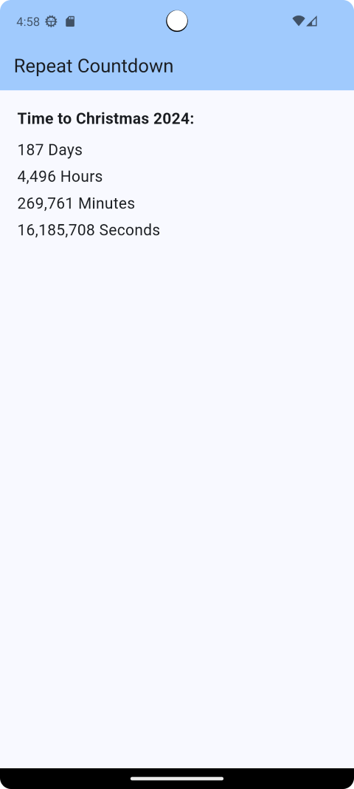

# Repeat Countdown App (Flutter)

A repeating countdown timer created in Flutter

A while back, while anticipating a particular event, I decided to create an app that allowed me track the number of days until the event. One thing led to another and I created this app. 

In the app's code, you define Month and Day integer values as constants. Then, when you run the app, it keeps a running countdown until the selected event date tracking Days, Hours, Minutes, and Seconds until the selected date. When the clock reaches the specified date, the counter resets and starts tracking the next year's event.

